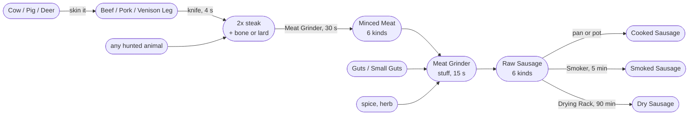

# From Meat to Sausage

The one chain end to end: from the animal you just shot to the sausage on your
plate, and from there to a sausage that keeps.

Every number on this page comes from the shipped data, and each step names the file
it was read from. If a claim here has gone stale, the file will say so.

Related pages: [Recipe-Book](Recipe-Book), [Recipe-Reference](Recipe-Reference),
[Processing-Stations](Processing-Stations), [Production-Chains](Production-Chains),
[Food-States](Food-States).

## The whole chain in one picture



Five steps, two of them at the same station. The Meat Grinder does the mincing
**and** the stuffing — that is why it is the one station you cannot skip.

## What you need before you start

| Thing | Where it comes from |
|---|---|
| A knife | Any of the eight classes in tool group `CUTTING_TOOL` — see [Processing-Stations](Processing-Stations#tool-groups) |
| **Meat Grinder** | Deployed station, cargo 5×3. Both sausage steps happen here |
| A casing | `Guts` or `SmallGuts` — vanilla's own guts, dropped when you gut an animal. There is no ChefZ casing item and no cleaning step |
| A spice | Anything tagged `CHEFZ_SPICE`, listed below |
| Cookware, a Smoker or a Drying Rack | Depending on which of the three endings you want |

**The spices that count.** Nine items carry `CHEFZ_SPICE`, and every stuffing slot
that asks for a spice accepts any of them:

> Salt · Black Pepper · Dried Peppercorns · Dried Paprika · Paprika Powder ·
> Pepper Berries · Chili · Herb Mix · Hunter Seasoning

Mushroom Culture is filed under category `SPICE` but does **not** carry the tag, so
it can never end up in a sausage. That separation is deliberate
(`ChefZ_Processing/Config/Processing/HerbGrinding.json`, note on `TR_HunterSeasoning`).

**Salt is the cheap one.** A spice slot draws **one unit**. Salt is measured in
grams with 200 units to the bag, so a sausage costs 1 g out of 200. Every other
spice is a `PIECE` item with one unit to its name, so one unit is the whole item.
Six sausages seasoned with salt cost 6 g; six seasoned with black pepper cost six
peppers.

## Step 1 — The animal

Three animals drop a ChefZ **primal cut** when skinned, on top of vanilla's own
steaks. Everything else you hunt gives vanilla steaks only, and that is fine —
the chain joins up again at step 3.

| Animal | Skinning yield | Count |
|---|---|---|
| `Animal_BosTaurus`, `Animal_BosTaurusF` (cow) | `ChefZ_BeefLeg` | 1 |
| `Animal_SusDomesticus` (pig) | `ChefZ_PorkLeg` | 1 |
| `Animal_CervusElaphus`, `Animal_CervusElaphusF` (red deer) | `ChefZ_VenisonLeg` | 1 |
| `Animal_CapreolusCapreolus` (roe deer) | `ChefZ_VenisonLeg` | 1 |

`ChefZ_Meat/config.cpp`, `class Skinning`. Reindeer is deliberately **not** in the
list: it drops `ReindeerSteakMeat`, which no transform in this chain accepts, and a
reindeer leg that fell apart into red deer steaks would be a silent relabelling.

`transferToolDamageCoef = 1` — a blunt knife gives you a damaged leg.

## Step 2 — Leg becomes steaks

```
1x Beef Leg      + knife  =  2x Cow Steak    + 1x Bone
1x Pork Leg      + knife  =  2x Pig Steak    + 1x Lard
1x Venison Leg   + knife  =  2x Deer Steak   + 1x Bone
```

Handcraft, `PROCESS_CUT_MEAT`, **4 s**, tool group `CUTTING_TOOL`. No station.
`ChefZ_Meat/Config/Processing/Meat.json`.

The bone is not waste — two to four bones plus root vegetables and a herb make
**Bone Broth** in a pot, and broth is the premium base under three of the bowl
dishes. The lard is the `FAT` that six plate dishes ask for.

**The same knife also dices.** `TR_DicedMeat` shares `PROCESS_CUT_MEAT` and takes
*any* raw meat that is not already mince or sausage:

```
1x any raw meat + knife  =  1x Diced Meat
```

It sits at priority 0 against the legs' 20, so a leg still becomes steaks and
everything else becomes cubes. Diced Meat is filed under both `MEAT` and
`MINCED_MEAT`, which is the part worth knowing: **every slot that asks for minced
meat accepts diced meat too**, including the sausage stuffing.

## Step 3 — Steaks become mince

At the **Meat Grinder**. `PROCESS_GRIND_MEAT`, `STATION_TIMED`, **30 s**, no tool.

```
1x Pig Steak       =  1x Minced Pork      (+ Lard, 50%)
1x Deer Steak      =  1x Minced Venison
1x Boar Steak      =  1x Minced Boar      (+ Lard, 35%)
1x Chicken Breast  =  1x Minced Chicken
1x Bear Steak      =  1x Minced Bear      (+ Lard, 60%)
1x any other raw meat  =  1x Minced Meat  (+ Lard, 35%)
```

One steak in, one full 250-unit pack out. The five species transforms sit at
priority 20 and the catch-all `TR_MeatToMinced` at 0, so pork becomes *Minced Pork*
rather than generic mince — the specific transform always wins.

**Cow, sheep, goat, rabbit and wolf have no species transform**, so they all come
out as plain *Minced Meat*. That is not an oversight: only the five kinds that a
named sausage needs got their own class.

The selector excludes `MINCED_MEAT` and `SAUSAGE` explicitly. Without that the
grinder would happily mince its own output over and over.

## Step 4 — Stuffing

Still at the **Meat Grinder**. `PROCESS_STUFF_SAUSAGE`, `STATION_ACTION`, **15 s**.
Six recipes, and this is the heart of the page:

```
Raw Sausage
  1x minced meat  +  1x spice  +  1x casing                            =  1x Raw Sausage

Raw Pork Sausage
  1x Minced Pork  +  1x spice  +  1x spice  +  1x casing               =  1x Raw Pork Sausage

Raw Venison Sausage
  1x Minced Venison  +  1x spice  +  1x herb  +  1x casing             =  1x Raw Venison Sausage

Raw Boar Sausage
  1x Minced Boar  +  1x spice  +  1x herb  +  1x casing                =  1x Raw Boar Sausage

Raw Spicy Sausage
  1x minced meat  +  1x spice  +  1x spice  +  1x spice  +  1x casing  =  1x Raw Spicy Sausage

Raw Hunter Sausage
  2x raw wild meat  +  1x spice  +  1x spice  +  1x casing             =  1x Raw Hunter Sausage
```

`ChefZ_Meat/Config/Processing/Meat.json`. *herb* is category `HERB` or `DRIED_HERB`
— the fresh or dried form of parsley, thyme, rosemary or wild garlic, plus Herb Mix.

**Which recipe fires** is decided by specificity, not by order. Priorities are 0 for
the generic Raw Sausage, 20 for pork, 25 for spicy and hunter, 30 for venison and
boar. Put Minced Venison, a spice, a herb and a casing in the grinder and you get a
*Venison* sausage; drop the herb and you fall back to the plain one.

**Hunter Sausage is the odd one out — and the good one.** It is the only stuffing
recipe that takes **whole raw wild meat** instead of mince: two pieces of anything
in category `WILD_MEAT` at vanilla stage `Raw`. It carries `qualityDelta 1.0`, its
meat slot is worth +2 grade points and its second spice slot +1. It is also the
only sausage tagged `CHEFZ_PREMIUM`, which is worth **+2 grade points** in every
recipe that later cooks with it.

So the shortest route to the best sausage skips the grinder entirely for the meat:

```
2x Deer Steak (raw) + 2x spice + 1x Guts  =  1x Raw Hunter Sausage
```

`WILD_MEAT` covers **deer, boar and rabbit** — and nothing else you can carry
whole. **Wolf and bear do not count**: both are category `PREDATOR_MEAT`. They
carry the *tag* `CHEFZ_WILD_MEAT`, but this slot binds on the category, and the two
are not the same list. The selector also excludes `MINCED_MEAT`, so mince does not
qualify either. It has to be whole deer, boar or rabbit.

## Step 5 — Three endings

A raw sausage is food, but poor food and it spoils fast. There are three ways to
finish it, and they are not variations of each other — they lead to three different
items with three different spoilage rates.

### Cooking — the fast one

Any **Frying Pan, Pot or Cauldron**, any fire. Baking or boiling. The sausage is
done when vanilla's own food stage flips to `Baked` or `Boiled` — there is no timer
to watch.

```
1x Raw Sausage          =  1x Cooked Sausage
1x Raw Pork Sausage     =  1x Pork Sausage
1x Raw Venison Sausage  =  1x Venison Sausage
1x Raw Boar Sausage     =  1x Boar Sausage
1x Raw Hunter Sausage   =  1x Hunter Sausage
1x Raw Spicy Sausage    =  1x Spicy Sausage
```

`ChefZ_Meat/Config/Recipes/Sausage.json`. Freshness and temperature carry over from
the raw sausage. Spoilage runs at ×0.8 for state `COOKED`.

### Smoking — the balanced one

At the **Smoker**. `PROCESS_SMOKE`, **5 minutes**, and unlike drying it takes
**fuel**: the Smoker burns bark from its own cargo, and five minutes of full burn
costs two pieces.

```
1x any raw sausage  =  1x Smoked Sausage
```

Note the input: category `SAUSAGE` in state `RAW`, not a named class. **All six raw
sausages smoke into the same Smoked Sausage** — the variety is lost. Spoilage
drops to ×0.25.

### Drying — the slow one

At the **Drying Rack**. `PROCESS_DRY`, **90 minutes**, no fuel, no tool.

```
1x any raw sausage  =  1x Dry Sausage
```

Same story: one output class for all six inputs. Spoilage drops to **×0.15**, the
lowest figure in the whole mod — a dry sausage is the closest thing ChefZ has to a
tin can.

### Which ending to pick

| Ending | Time | Cost | Spoilage | Energy | Water | Keeps the variety |
|---|---|---|---|---|---|---|
| Cook | until `Baked`/`Boiled` | firewood | ×0.80 | 470–530 | 16–18 | **yes** |
| Smoke | 5 min | 2× bark | ×0.25 | 500 | 14 | no |
| Dry | 90 min | — | **×0.15** | **545** | 6 | no |

Energy from `ChefZ_Registry/Config/Nutrition.json`, spoilage multipliers from
`ChefZ_Registry/Config/Preservation.json`. Dry Sausage is the most energy-dense
food in the chain and the driest — it will not help your thirst.

**Hunter Sausage is the only reason to cook rather than preserve.** At 525 energy
it beats the smoked one, it keeps its `CHEFZ_PREMIUM` tag, and that tag is worth
+2 grade points in Scrambled Eggs with Sausage, Farmer's Breakfast and the Sausage
and Bread Plate. Smoke it and you get a generic Smoked Sausage worth +1 for being
preserved.

## A worked example: one pig into six meals

```
1. Shoot and skin a pig            ->  1x Pork Leg  (+ vanilla pig steaks)
2. Knife, 4 s                      ->  2x Pig Steak  + 1x Lard
3. Grinder, 30 s, twice            ->  2x Minced Pork  (+ lard, 50% each)
4. Grinder, 15 s, twice            ->  2x Raw Pork Sausage
   each: 1x Minced Pork + 2 g Salt + 1x Guts
5. Frying pan                      ->  2x Pork Sausage
6. Frying pan, with them:
   1-4x Potato + 1-3x Pork Sausage + the Lard from step 2
                                   ->  1x Sausage and Potatoes  (2 helpings)
```

Total cost beyond the pig: two guts, 2 g of salt, some potatoes and a fire.
Total time at the stations: 2 × 30 s + 2 × 15 s = **90 seconds**.

## Where sausage goes from here

Seven cooking recipes take a sausage. Every one of them binds on the **category**
`SAUSAGE`, so any of the fourteen sausage classes — raw, cooked, dry or smoked —
satisfies the slot:

| Dish | The rest of it |
|---|---|
| Sausage Pasta | pasta, fat or butter |
| Sausage and Potatoes | potato, fat or butter |
| Blood Sausage Plate | potato, root vegetable |
| Beans and Sausage | beans, root vegetable |
| Scrambled Eggs with Sausage | 2–4× egg, dairy |
| Farmer's Breakfast | potato, egg, onion |
| Sausage and Bread Plate | bread, cheese — **no heat needed** |

Full ingredient lists on [Recipe-Book](Recipe-Book).

## Two things that will catch you out

**A raw sausage in a pot without a matching recipe just cooks the vanilla way.**
That is by design and it is the mod's first rule — if nothing binds, vanilla runs
and nothing is lost. It also means a failed ChefZ recipe is silent. If you expected
a Pork Sausage and got a burnt one, check that the class was `ChefZ_RawPorkSausage`
and not the generic raw sausage.

**Smoked Meat works since 2026-08-31.** `TR_SaltedMeatToSmoked` in
`ChefZ_Preservation/Config/Processing/Smoking.json` carried no `process` field, so
the process compiler dropped it at boot (`ChefZ_ProcessCompiler.c:355`) and Salted
Meat had no path to Smoked Meat. The two missing lines — `PROCESS_SMOKE` and
`stationsAllowed: ["ChefZ_Smoker"]` — are in, and all three transforms in the file
now have the same shape: five minutes at the smoker, bark as fuel. Not yet seen in
a running game. See [Known-Limitations](Known-Limitations).

## See also

- [Recipe-Book](Recipe-Book) — every dish as `X + Y = Z`
- [Recipe-Reference](Recipe-Reference) — the same recipes with quality, policy and timing columns
- [Processing-Stations](Processing-Stations) — the Meat Grinder, Smoker and Drying Rack in full
- [Production-Chains](Production-Chains) — the other ten chains
- [Quality-and-Nutrition](Quality-and-Nutrition) — what grade points do
