# Production Chains

How a raw material becomes a meal. Every step below is a real record in the shipped
data — a *transform* at a station or in the handcraft menu, or a *recipe* in cookware.

| Chain | Steps | Stations involved | Ends in |
|---|---|---|---|
| [Grain](#grain) | 5 transforms + 2 recipes | Grain Mill, Drying Rack | Bread, Flatbread, Pasta |
| [Salt](#salt) | 2 transforms | Frying Pan | `SALT` — required or optional in 35 recipes |
| [Herbs and spices](#herbs-and-spices) | 10 transforms | Drying Rack, Mortar | `DRIED_HERB`, `SPICE` |
| [Vegetables](#vegetables) | no transforms since 29.08.2026 | none | `ROOT_VEGETABLE`, `LEAF_VEGETABLE`, `TOMATO` |
| [Meat and sausage](#meat-and-sausage) | 16 transforms + 6 recipes | Meat Grinder | Six cooked sausages |
| [Milk](#milk) | 3 transforms | Butter Churn, Cheese Press | Cream, Butter, Cheese |
| [Fish](#fish) | 3 transforms | Drying Rack, Smoker | `FISH`, preserved fish |
| [Preservation](#preservation) | 7 transforms, plus the 3 fish steps above | Drying Rack, Smoker | `CHEFZ_PRESERVED` |
| [Tableware](#tableware) | 5 transforms | none — handcraft | The five empty containers |
| [Honey](#honey) | 7 handcraft transforms + 1 station transform + the hive script | Beehive, Honey Extractor | vanilla `Honey` |

**Read the diagrams like this:** rounded boxes are items, the label on an arrow is
the station or the tool, and `[]` boxes are the dishes a chain feeds into.

> **Nothing in this mod spawns by itself.** ChefZ ships no `types.xml`. Every chain
> head below — wheat, the five vegetables, the four herbs, eggs, the three legs —
> needs an admin spawn until a loot table exists. Since 29.08.2026 they are *found*
> items rather than crops, which makes the missing loot table the only thing between
> them and the world. Milk is vanilla `PowderedMilk` and spawns on its own.
> See [Known-Limitations](Known-Limitations).

## Grain

Wheat is the only crop ChefZ adds that is not a vegetable. It is the head of the
longest chain in the mod: three steps from the found grain to dried pasta. (Since
2026-08-29 wheat is found in the world, like mushrooms — no seeds, no garden plot.)

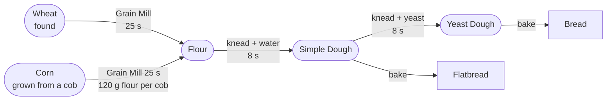

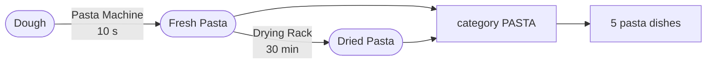

| Step | Input | Output | Where | Tool | Duration |
|---|---|---|---|---|---|
| `TR_WheatToFlour` | 1× Wheat | Flour (×0.78 of input) | Grain Mill | — | 25 s |
| `TR_CornToFlour` | 1-5× Corn | Flour (120 g per cob) | Grain Mill (currently no cargo, see [Known-Limitations](Known-Limitations)) | — | 25 s |
| `TR_FlourWaterToDough` | 1× Flour (250) + 1× container with Water (150) | Dough (1×) | *handcraft* | — | 8 s |
| `TR_DoughToRawPasta` | 1× Dough | Fresh Pasta (500×) | *handcraft* | `ROLLING_PIN` (pasta machine) | 10 s |
| `TR_RawPastaToDriedPasta` | 1× Fresh Pasta | Dried Pasta (1:1) | Drying Rack | — | 30 min |
| `TR_AssemblePastaMachine` | 1× `MetalPlate` | Pasta Machine (1×) | *handcraft* | `METALWORK_TOOL` | 25 s |

The pasta machine is equipment, not food, but it belongs to this chain: it is the
`ROLLING_PIN` tool group that `TR_DoughToRawPasta` demands, and building one from a
metal plate is the only way to get it — there is no `types.xml`.

Then in cookware:

| Recipe | Input | Cookware | Done at |
|---|---|---|---|
| `REC_ChefZ_Bread` | 1× Dough | Pot, OvenIndoor | food stage `Baked` |
| `REC_ChefZ_Flatbread` | 1× Dough | FryingPan | food stage `Baked` |

One dough since 2026-08-29 — no yeast, no pasta dough. The **cookware** decides:
pot or oven bakes bread, the pan bakes flatbread.

**Where it feeds in.** `PASTA` is required by 5 recipes (Survivor Spaghetti,
Sausage Pasta, Hunter Pasta, Creamy Mushroom Pasta, Chernarus Mac and Cheese).
`BREAD` is required by 3 (Tactical Bacon Breakfast, Sausage and Bread Plate,
Honey Bread Platter). `DOUGH` is required by 2 (Cheese Flatbread, Meat Dumplings).

**Gaps.** `ChefZ_Wheat` is found in the world; without it the chain does not
start. The knead step also needs a **water container**: `TR_FlourWaterToDough`
matches `isLiquidContainer` with `liquidType: "Water"` and takes 150 units.

## Salt

Two steps, and by far the most expensive process in the mod: 15 minutes of burning
fire plus 20 minutes of drying, for a ratio of 0.04 × 0.67 ≈ **2.7 % of the sea
water you started with**.

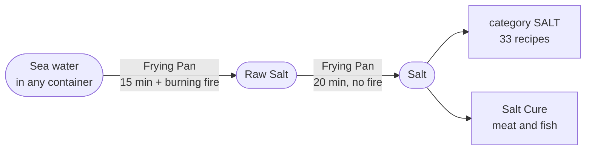

| Step | Input | Output | Where | Tool | Duration |
|---|---|---|---|---|---|
| `TR_SaltwaterToRawSalt` | 1× container with SaltWater (0.6) | Raw Salt (×0.04 of input) | Frying Pan | — | 15 min + heat |
| `TR_RawSaltToSalt` | 1× Raw Salt | Salt (×0.67 of input) | Frying Pan | — | 20 min |

The heat requirement is a proximity check, not a temperature threshold:
`ChefZ_FryingPan.ChefZ_HasHeat()` looks for a burning `FireplaceBase` within range.
If the fire goes out the job **pauses**; it never rolls back and never loses the
brine. Drying does not need heat, so the fire may go out for the second half.

**Where it feeds in.** `SALT` appears in 35 of the 47 recipes — almost always as
an optional slot worth +1 or +2 grade points, at 3 to 12 g per dish. It is also a
hard requirement of the three sauces and of both salt-curing transforms in the
[preservation chain](#preservation), which take 20 units each.

## Herbs and spices

Four fresh herbs, two spice crops, and four ground products. Everything dries on the
rack and everything grinds in the mortar.

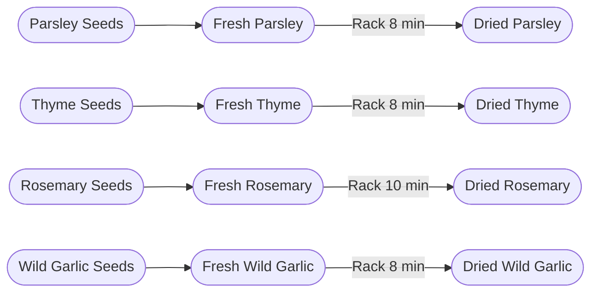

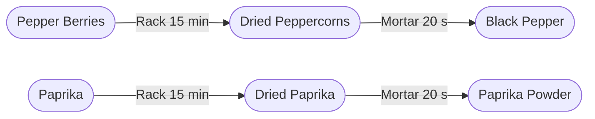

| Step | Input | Output | Where | Tool | Duration |
|---|---|---|---|---|---|
| `TR_ParsleyToDried` | 1+× Fresh Parsley | Dried Parsley (1:1) | Drying Rack | — | 8 min |
| `TR_ThymeToDried` | 1+× Fresh Thyme | Dried Thyme (1:1) | Drying Rack | — | 8 min |
| `TR_RosemaryToDried` | 1+× Fresh Rosemary | Dried Rosemary (1:1) | Drying Rack | — | 10 min |
| `TR_WildGarlicToDried` | 1+× Fresh Wild Garlic | Dried Wild Garlic (1:1) | Drying Rack | — | 8 min |
| `TR_PaprikaToDried` | 1+× Paprika | Dried Paprika (1:1) | Drying Rack | — | 15 min |
| `TR_PepperBerriesToDried` | 1+× Pepper Berries | Dried Peppercorns (1:1) | Drying Rack | — | 15 min |
| `TR_PeppercornsToBlackPepper` | 1+× Dried Peppercorns | Black Pepper (1:1) | Mortar and Pestle | — | 20 s |
| `TR_DriedPaprikaToPowder` | 1+× Dried Paprika | Paprika Powder (1:1) | Mortar and Pestle | — | 20 s |
| `TR_HerbMix` | 1+× Dried Thyme + 1+× Dried Parsley + 1+× Dried Rosemary | Herb Mix (1×) | Mortar and Pestle | — | 25 s |
| `TR_HunterSeasoning` | 1+× Black Pepper + 1+× Paprika Powder + 1+× Dried Thyme + 1+× Dried Wild Garlic + 1+× *SPICE* | Hunter Seasoning (1×) | Mortar and Pestle | — | 35 s |

**Where it feeds in.** The tag `CHEFZ_HERB` is used by 25 recipes and
`CHEFZ_SPICE` by 22, nearly always as an optional grade slot. Both the fresh and
the dried form carry `CHEFZ_HERB`, so drying is never mandatory — but
19
recipes have a `gradeRule` that pays an extra point for freshness at or above 0.8
(0.85 for fish and fresh produce), which only an unprocessed ingredient can reach. Hunter Seasoning is worth **+2** in seven recipes:
all three Hunter Stew variants, both Chernarus Chili variants, Hunter Pasta and
Hunter Plate.

The spice chain is also where the sausage chain gets its seasoning: all six
sausage transforms require one to three `SPICE` items (Venison and Boar swap the second spice for a herb).

## Vegetables

Five ChefZ crops (onion, garlic, carrot, cabbage, corn) plus one spice crop (paprika),
alongside vanilla potato, tomato and green bell pepper. The chain is a closed loop:
four of the five ChefZ vegetables are found in the world, like mushrooms (no seeds
since 2026-08-29).

**Corn is the exception, and the only ChefZ crop that is grown.** Since 30.08.2026
`ChefZ_Corn` carries a `Horticulture` block naming `PlantType = "ChefZ_CornPlant"`: the
cob is its own seed, and `ChefZ_CornPlant : PlantBase` grows in a garden plot with its
own model. Everything else in this chain is still picked up off the ground. Corn also
doubles as a mill input — see [Grain](#grain).

Where corn goes: it has its own optional slot in Chernarus Chili, Vegetable Soup
and Farmer's Breakfast (each also in the group version where one exists). Because
its ingredient record carries the category `VEGETABLE`, it is also accepted by
Bone Broth Soup's `veg` slot without any recipe change — that is the reach of the
category decision, and it is deliberate. No recipe slot matches `GRAIN`, so the
second category has no effect on cooking. Every recipe involved keeps its
required ChefZ-only anchor, so vanilla cooking is untouched (I2).

Since 2026-08-29 there is no chopping step either: the knife-cut variants
(`Chopped*`, `ChefZ_SlicedPotato`) are gone, and every recipe takes the whole
vegetable — which every one of them already accepted as the alternative.

**Where it feeds in.** `ROOT_VEGETABLE` is used by 14 recipes,
`TOMATO` by 5, `LEAF_VEGETABLE` by 2, `VEGETABLE` by 2.

**The one processing step that matters** is Chernarus Chili, which needs
`ChefZ_PaprikaPowder` in a **required** slot — that one has to come out of the
[spice chain](#herbs-and-spices).

The chain therefore has **no transforms left at all**. `ChefZ_Produce` reserves
`handcraftRecipeSlots = 0` in `ChefZ_Ingredients/config.cpp` — it once held eleven,
then seven, and the last of them went with the chopping step. A vegetable goes from
the ground into the pot.

## Meat and sausage

The longest chain by step count, and the one where the two halves of a station
matter: the Meat Grinder both minces and stuffs.

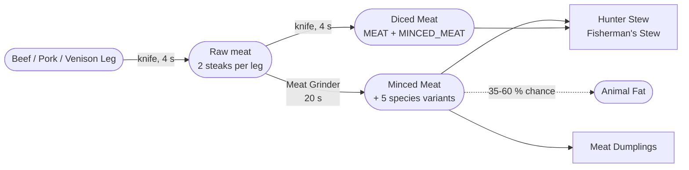

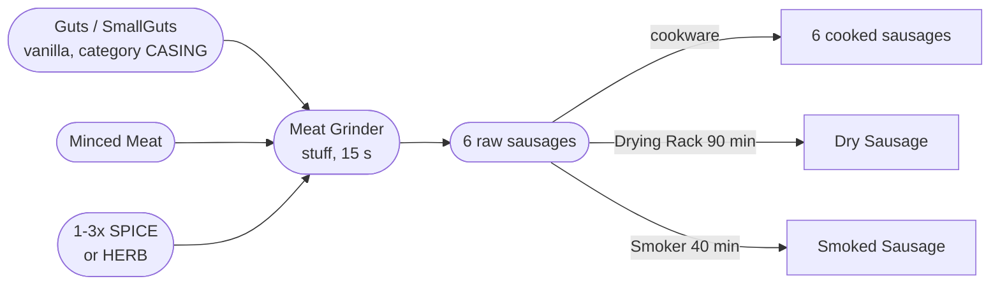

### Cutting the legs

The three primal cuts are the only ChefZ-owned raw meat. Each one splits into two
vanilla steaks, which is where this chain joins the rest of the mod — everything
downstream matches vanilla `MEAT`, so a hunted animal and a butchered leg feed the
same transforms.

| Step | Input | Output | Where | Tool | Duration |
|---|---|---|---|---|---|
| `TR_CutBeefLeg` | 1× `ChefZ_BeefLeg` | 2× `CowSteakMeat` | *handcraft* | `CUTTING_TOOL` | 4 s |
| `TR_CutPorkLeg` | 1× `ChefZ_PorkLeg` | 2× `PigSteakMeat` | *handcraft* | `CUTTING_TOOL` | 4 s |
| `TR_CutVenisonLeg` | 1× `ChefZ_VenisonLeg` | 2× `DeerSteakMeat` | *handcraft* | `CUTTING_TOOL` | 4 s |

### Mincing

| Step | Input | Output | Where | Tool | Duration |
|---|---|---|---|---|---|
| `TR_MeatToMinced` | 1+× *MEAT* + stage Raw | Minced Meat (1:1) | Meat Grinder | — | 20 s |
| `TR_PorkToMinced` | 1+× Pig Steak + stage Raw | Minced Pork (1:1) | Meat Grinder | — | 20 s |
| `TR_VenisonToMinced` | 1+× Deer Steak + stage Raw | Minced Venison (1:1) | Meat Grinder | — | 20 s |
| `TR_BoarToMinced` | 1+× Boar Steak + stage Raw | Minced Boar (1:1) | Meat Grinder | — | 20 s |
| `TR_ChickenToMinced` | 1+× Chicken Breast + stage Raw | Minced Chicken (1:1) | Meat Grinder | — | 20 s |
| `TR_BearToMinced` | 1+× Bear Steak + stage Raw | Minced Bear (1:1) | Meat Grinder | — | 20 s |

The six mincing transforms are ordered by priority — the generic `TR_MeatToMinced`
sits at 0, the five species transforms at 20, so pork becomes Minced Pork rather than
generic Minced Meat.

### Dicing

Dicing was removed on 29.08.2026 and **came back the same day**, once the delivered
models arrived: `beefcubes.p3d` gave the cube its own geometry, and a class that had
only ever been a vanilla proxy was worth having again.

| Step | Input | Output | Where | Tool | Duration |
|---|---|---|---|---|---|
| `TR_DicedMeat` | 1+× *MEAT* + stage Raw | Diced Meat | *handcraft* | `CUTTING_TOOL` | 4 s |

It shares `PROCESS_CUT_MEAT` with the three leg cuts and sits at priority 0 against
their 20, so a leg still becomes steaks and everything else raw becomes cubes.

`ChefZ_DicedMeat` is filed under **`MEAT` and `MINCED_MEAT`** with state `PREPARED`,
which is the part worth knowing: every slot that asks for `MINCED_MEAT` accepts diced
meat too. The stews reach it without naming it.

### Stuffing

The casing is vanilla's own gut since 2026-08-29 — `Guts` or `SmallGuts`, both
category `CASING`; there is no cleaning step and no ChefZ casing class.

| Step | Input | Output | Where | Tool | Duration |
|---|---|---|---|---|---|
| `TR_RawSausage` | 1+× *MINCED_MEAT* + 1+× *SPICE* (1) + 1+× *CASING* (Guts or Small Guts) | Raw Sausage (1×) | Meat Grinder | — | 15 s |
| `TR_RawPorkSausage` | 1+× Minced Pork + 1+× *SPICE* (1) + 1+× *SPICE* (1) + 1+× *CASING* (Guts or Small Guts) | Raw Pork Sausage (1×) | Meat Grinder | — | 15 s |
| `TR_RawVenisonSausage` | 1+× Minced Venison + 1+× *SPICE* (1) + 1+× *HERB* or *DRIED_HERB* (1) + 1+× *CASING* (Guts or Small Guts) | Raw Venison Sausage (1×) | Meat Grinder | — | 15 s |
| `TR_RawBoarSausage` | 1+× Minced Boar + 1+× *SPICE* (1) + 1+× *HERB* or *DRIED_HERB* (1) + 1+× *CASING* (Guts or Small Guts) | Raw Boar Sausage (1×) | Meat Grinder | — | 15 s |
| `TR_RawHunterSausage` | 2× *WILD_MEAT* + stage Raw + 1+× *SPICE* (1) + 1+× *SPICE* (1) + 1+× *CASING* (Guts or Small Guts) | Raw Hunter Sausage (1×) | Meat Grinder | — | 15 s |
| `TR_RawSpicySausage` | 1+× *MINCED_MEAT* + 1+× *SPICE* (1) + 1+× *SPICE* (1) + 1+× *SPICE* (1) + 1+× *CASING* (Guts or Small Guts) | Raw Spicy Sausage (1×) | Meat Grinder | — | 15 s |

`TR_RawHunterSausage` is the only stuffing transform that takes **whole raw wild
meat** instead of mince — 2× `WILD_MEAT` at stage `Raw`. It is also the only
sausage tagged `CHEFZ_PREMIUM`, which is worth +2 grade points in six recipes.

### Cooking

The six raw sausages become their cooked classes in any Frying Pan, Pot or Cauldron
on food stage `Baked` or `Boiled`. See
[Recipe-Reference](Recipe-Reference#sausage--cooking-the-raw-sausages).

**Where it feeds in.** `SAUSAGE` is used by 9 recipes, `MINCED_MEAT` by 1,
`MEAT` by 2, `WILD_MEAT` by 2. Diced Meat fills a required slot in all three
Hunter Stew variants, as one of three allowed classes.

**Gaps.** Both stations in this chain — the Cutting Board and the Meat Grinder —
currently have **no cargo block**, so nothing can be put into them. That breaks the
chain at its two narrowest points: no casing, therefore no raw sausage, therefore
none of the six cooked sausages, and no Dry or Smoked Sausage either. Diced Meat is
unaffected, because it is handcraft. See
[Processing-Stations](Processing-Stations) and [Known-Limitations](Known-Limitations).

## Milk

Three transforms, two stations, no tools. Milk is loot-only.

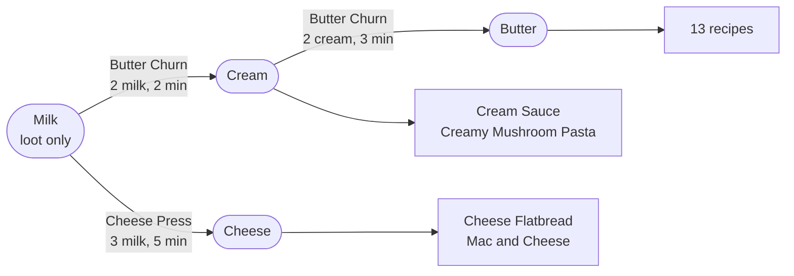

| Step | Input | Output | Where | Tool | Duration |
|---|---|---|---|---|---|
| `TR_MilkToCream` | 2× Milk | Cream (1×, no mode given) | Butter Churn | — | 2 min |
| `TR_CreamToButter` | 2× Cream | Butter (1×, no mode given) | Butter Churn | — | 3 min |
| `RCP_ChefZ_CheeseCurd` | 3× Milk + 1× Mushroom Culture | Cheese Curd | Pot/Cauldron, boiling ≥60° | — | 5 min |
| `TR_CurdToCheese` | 1× Cheese Curd | Cheese (1×, no mode given) | Cheese Press | — | 5 min |

The culture comes from grinding a **rotten** mushroom in the mortar
(`TR_RottenMushroomToCulture`, 20 s). The old direct route `TR_MilkToCheese`
(3× Milk → Cheese at the press) was replaced on 2026-08-31 by this two-stage
chain; with the direct route in place the culture and the kettle step would
have been decoration.

Cream and cheese are **items, not liquids** in V1. None of the three transforms
mentions `isLiquidContainer` or `liquidType`; the stations carry them in cargo like
any other item.

Milk, Cream and Butter carry no `Food` block on purpose — without food stages
`HasFoodStage()` is false, `CanBeCooked()` returns false, and vanilla's
`Cooking.ProcessItemToCook` leaves them alone. Cheese and Butter **do** carry one,
because both sit in a mandatory slot of a pan recipe and would otherwise fall
through to `BURNED`.

**Where it feeds in.** `BUTTER` appears in the slot selectors of 13 recipes,
`DAIRY` of 3 and `CREAM` of 4 — butter usually as one half of a
`FAT or BUTTER` alternative. Butter alone connects the milk chain to the pasta, pan and
sauce chains.

**Gaps.** None of the three dairy outputs declares a `quantityMode` or `quantity`.
Every other transform in the mod does. Two milk therefore yield one implicit cream.

## Fish

ChefZ adds no fish. It binds the four vanilla fillets as ingredients and gives them
a preservation path.

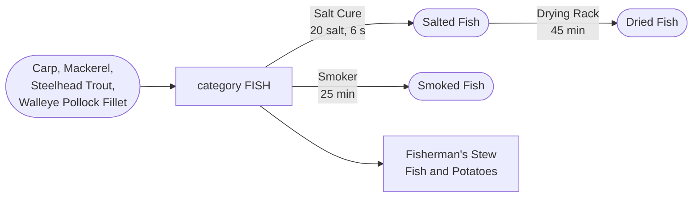

| Step | Input | Output | Where | Tool | Duration |
|---|---|---|---|---|---|
| `TR_SaltFish` | 1× *FISH* + state RAW + 1× *SALT* (20) | Salted Fish (1×) | *handcraft* | — | 6 s |
| `TR_SaltedFishToDried` | 1+× Salted Fish | Dried Fish (1:1) | Drying Rack | — | 45 min |
| `TR_FishToSmoked` | 1+× *FISH* + state RAW | Smoked Fish (1:1) | Smoker | — | 25 min + heat |

**Where it feeds in.** `FISH` is used by 4 recipes: the three Fisherman's Stew
variants and Fish and Potatoes. Salted, Dried and Smoked Fish all keep the `FISH`
category, so a preserved fillet still cooks.

**Gaps.** Smoked Fish is unreachable — see the smoker note under
[preservation](#preservation).

## Preservation

The one chain that spans several others. It takes finished products out of the meat,
fish and sausage chains and changes their **state** rather than their category, so a
preserved item still matches the recipes its fresh form matched.

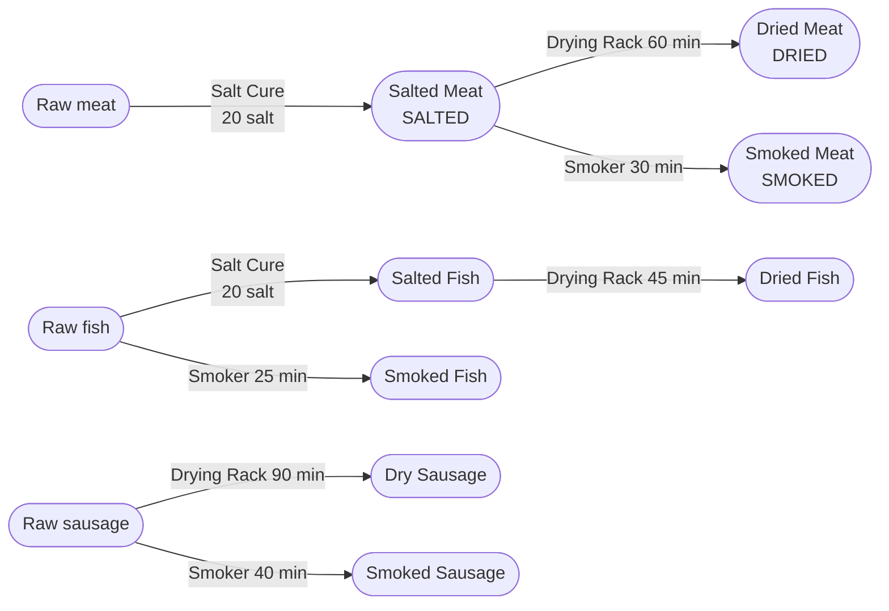

| Step | Input | Output | Where | Tool | Duration |
|---|---|---|---|---|---|
| `TR_SaltMeat` | 1× *MEAT* + state RAW + not *SAUSAGE* + 1× *SALT* (20) | Salted Meat (1×) | *handcraft* | — | 6 s |
| `TR_SaltedMeatToDried` | 1+× Salted Meat | Dried Meat (1:1) | Drying Rack | — | 60 min |
| `TR_SaltedMeatToSmoked` | 1+× Salted Meat | Smoked Meat (1:1) | Smoker | — | 30 min + heat |
| `TR_RawSausageToDry` | 1+× *SAUSAGE* + state RAW | Dry Sausage (1:1) | Drying Rack | — | 90 min |
| `TR_RawSausageToSmoked` | 1+× *SAUSAGE* + state RAW | Smoked Sausage (1:1) | Smoker | — | 40 min + heat |
| `TR_CaninaBerriesToDried` | 2× `CaninaBerry` | Dried Berries (1×) | Drying Rack | — | 7 min |
| `TR_SambucusBerriesToDried` | 2× `SambucusBerry` | Dried Berries (1×) | Drying Rack | — | 7 min |

The two berry transforms are the odd pair here: they preserve nothing that came out
of another ChefZ chain — both inputs are vanilla berries picked in the world — and
they converge on the same output. `ChefZ_DriedBerries` is category `BERRY`, tag
`CHEFZ_PRESERVED`, default state `DRIED`, and it is a **required** slot of Fruit
Compote, which makes seven minutes at the rack the price of that dish.

Salt curing is handcraft: no station, no tool, 6 seconds, 20 units of salt. Everything
after it needs a station and real time — 25 to 90 minutes.

All nine outputs carry the tag `CHEFZ_PRESERVED`, and the six that are meat or fish
keep their `MEAT` or `FISH` category. Smoking is the only path that skips the salt
step for fish; meat and sausage cannot be smoked without curing or stuffing first.

**Gaps — the smoking half of this chain does not run.** `PROCESS_SMOKE` sets
`requiresHeat = 1`, but `ChefZ_Smoker` is declared as
`class ChefZ_Smoker extends ChefZ_ProcessingStation_Base {}` and never overrides
`ChefZ_HasHeat()`, which the base returns `false` from. Independently, the station
record sets `needsFuel: true` while the class has no fuel slot, so
`ChefZ_IsPowered()` is false and `MeetsEnvironment` rejects first on
`stationPowered`. Smoked Meat, Smoked Fish and Smoked Sausage are therefore
unreachable in V1. The drying half is unaffected — `PROCESS_DRY` needs neither
heat nor fuel. See [Known-Limitations](Known-Limitations).

## Honey

The only chain whose middle step is not a transform. Bees fill the frames by
script inside the hive; everything before and after is handcraft or a station.
Reworked 2026-08-29 — the earlier sealed-frame step and the hive's timed
process are gone.

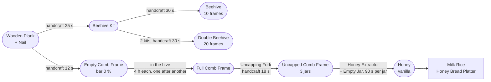

| Step | Input | Output | Where | Tool | Duration |
|---|---|---|---|---|---|
| `TR_BuildBeehiveKit` | 4× Wooden Plank + 10× Nail | Beehive Kit | handcraft | — | 25 s |
| `TR_RaiseBeehive` | 1× Beehive Kit | Beehive | handcraft | — | 30 s |
| `TR_ExtendBeehive` | 2× Beehive Kit | Double Beehive | handcraft | — | 30 s |
| `TR_BuildHoneycombFrame` | 1× Wooden Plank + 2× Nail | Empty Comb Frame | handcraft | — | 12 s |
| `TR_BuildUncappingFork` | 1× Wooden Plank + 4× Nail | Uncapping Fork | handcraft | — | 15 s |
| `TR_BuildBeeSmoker` | 1× opened Tuna Can | Bee Smoker | handcraft | — | 20 s |
| *(script, no transform)* | Empty Comb Frame in hive cargo | Full Comb Frame | Beehive | — | 4 h per frame |
| `TR_UncapHoneycombFrame` | 1× Full Comb Frame | Uncapped Comb Frame (3 jars) | handcraft | Uncapping Fork | 18 s |
| `TR_SpinHoney` | 1 jar's worth of an Uncapped Comb Frame + 1× Empty Jar | Honey (vanilla) | Honey Extractor | — | 90 s per jar |

**In the hive.** Up to 10 empty frames (20 in the double hive) sit in the cargo.
A server timer fills the *first* not-full frame — 4 h per frame, so a full hive
takes 40 h — and the frame's `quantityBar` rises like an apple's falls. A full
frame is swapped in its cell for a Full Comb Frame. The fill level is stored with
the frame; while the server is down no time passes (assumption A1).

**Out of the hive.** "Open Hive" (`PROCESS_HARVEST_HIVE`, 8 s) opens the lid for
120 s and wakes the bees. Only a **smoking** Bee Smoker in hand calms them - stuffed
with two pieces of bark (`TR_FillBeeSmoker`, handcraft), lit with a lighter or
matches (vanilla ignite action), burning ten minutes per fill; without it the
beekeeper always takes 20 shock and one bleeding arm, plus a second arm without
gloves and 15 more shock without a covered head. An NBC suit (jacket + trousers)
stops the bleeding, a gas mask seals the face, suit plus gas mask is the only
full protection (assumption A4). While the lid is open, and only then, a **Full**
frame can be dragged out; empty frames stay put.

**At the extractor.** Up to 5 uncapped frames and 15 empty jars
(`ChefZ_EmptyJar`, ~500 ml) go in. The player cranks once; after that the drum
runs a 90-second job per jar on its own until frames or jars run out
(assumption A3). Each job takes one unit off the frame (it carries 4: three
jars plus one reserve unit the core would otherwise delete the frame over),
consumes the jar and creates vanilla `Honey` in the cargo. A frame down to its
reserve unit becomes an Empty Comb Frame again — the chain loops. If the drum
stops (no jar, no frame, cargo full) it stays stopped until someone cranks again.

**Where it feeds in.** `Honey` is required by Milk Rice and Honey Bread Platter
and was vanilla loot only until this chain existed.

**Gaps.** `Honey` is a vanilla item whose config is not in the repository: its
size in the cargo and whether it takes the jar's exact cell cannot be promised.
The nail ingredient is vanilla `Nail` (`Nails` is a script-only class,
assumption A5).

## Tableware

Not food, but the chain everything portioned depends on: without a bowl there is
nothing to serve a stew into.

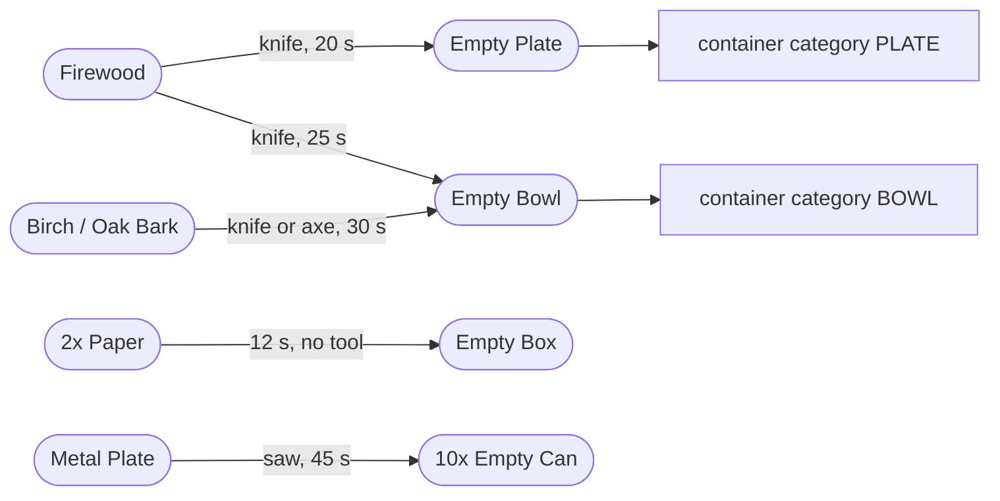

| Step | Input | Output | Where | Tool | Duration |
|---|---|---|---|---|---|
| `TR_CarveWoodenPlate` | 1× Firewood | Empty Plate (1×) | *handcraft* | `CUTTING_TOOL` | 20 s |
| `TR_CarveWoodenBowl` | 1× Firewood | Empty Bowl (1×) | *handcraft* | `CUTTING_TOOL` | 25 s |
| `TR_BowlFromBark` | 1× `Bark_Birch` | `Bark_Oak` | Empty Bowl (1×) | *handcraft* | `CUTTING_TOOL` or `AXE_TOOL` | 30 s |
| `TR_BoxFromPaper` | 2× `Paper` | Empty Box (1×) | *handcraft* | — | 12 s |
| `TR_CansFromMetalSheet` | 1× `MetalPlate` | Empty Can (**10×**) | *handcraft* | `SAWING_TOOL` | 45 s |

All five are handcraft. The plate, bowl, jar and box are marked reusable: they come
back when the dish is fully eaten, so they are permanent equipment rather than
consumables. The can is not — it is cut open and stays open. See
[Portions-and-Containers](Portions-and-Containers).

**Gaps.** `ChefZ_EmptyJar` is the one container with **no source at all** in V1:
nothing crafts it and nothing spawns it, because there is no `types.xml`. The other
four are craftable from vanilla materials, which is why the bark bowl and the metal
cans were added — a bowl should not depend on finding firewood alone.

## Chain coverage

All 61 transforms are accounted for above.

| | |
|---|---|
| Transforms | 61 |
| Of those, at a station | 39 |
| Of those, handcraft | 22 |
| Recipes fed by these chains | 47 |
| Chains blocked at least in part | 4 — grain (mill has no cargo), meat/sausage (no cargo), preservation (smoker), everything upstream of loot (no `types.xml`) |

Recounted 2026-08-29 after the apiary, the bee smoker fuel step and the return of
diced meat: 61 transforms, 9 of them in the apiary. The honey chain is the one chain
that is not blocked upstream — planks, nails and tuna cans are vanilla loot.

## See also

[Processing-Stations](Processing-Stations) · [Recipe-Reference](Recipe-Reference) ·
[Recipes](Recipes) · [Food-States](Food-States) ·
[Portions-and-Containers](Portions-and-Containers) · [Modules](Modules) ·
[Known-Limitations](Known-Limitations)
