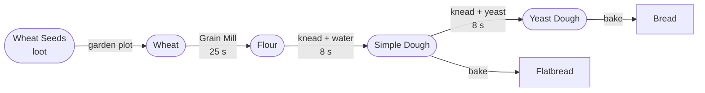
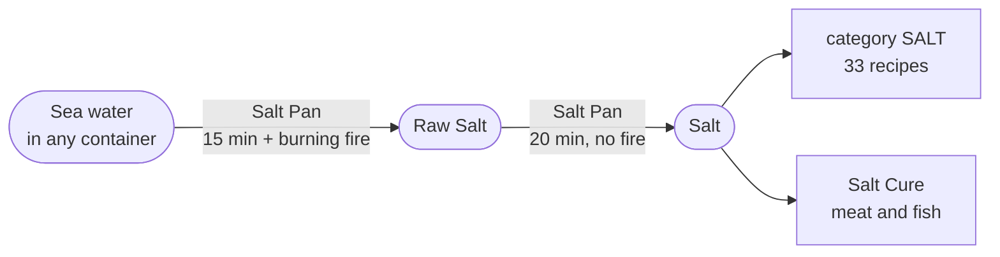
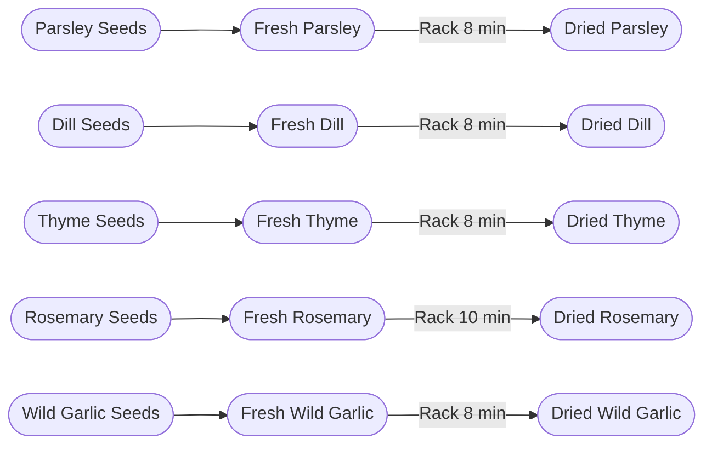
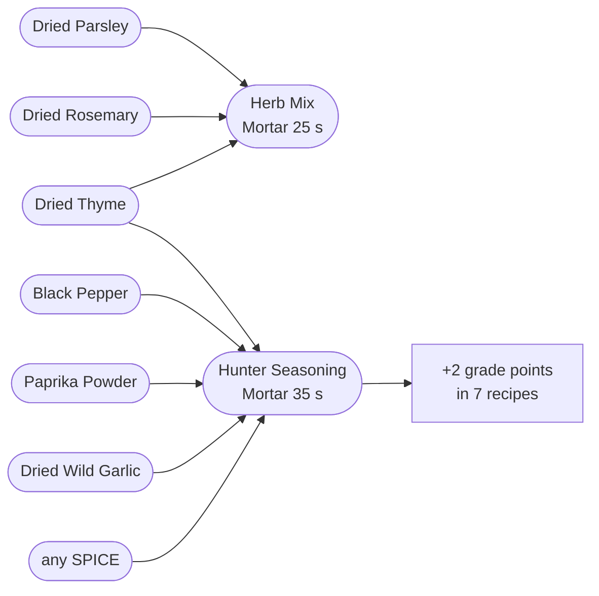
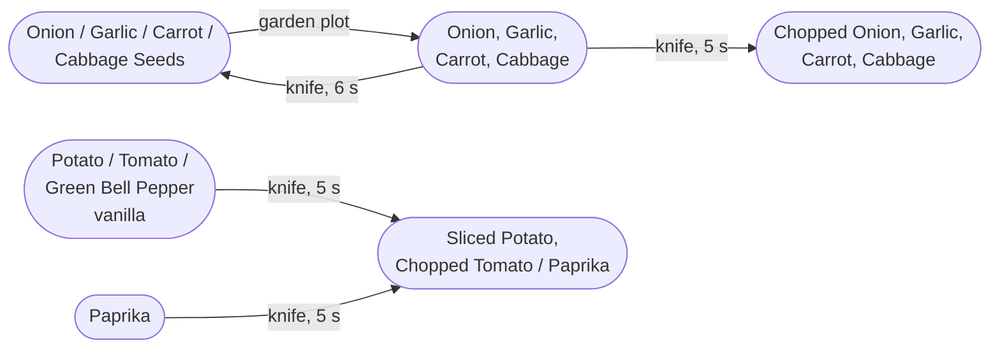
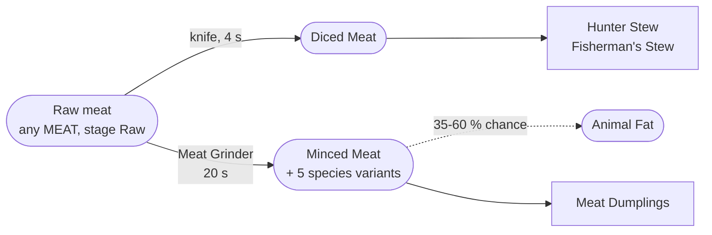
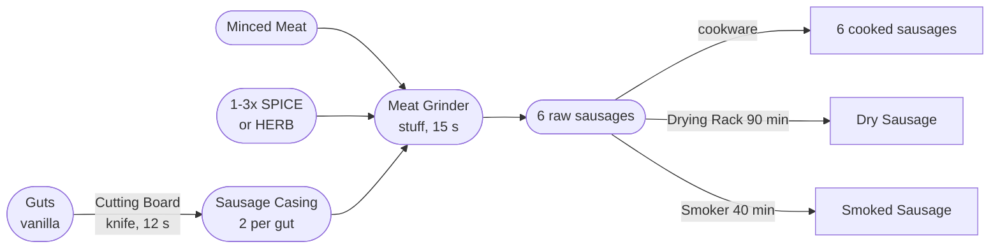
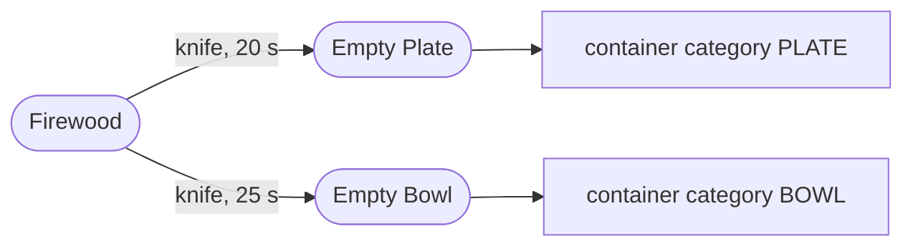

# Production Chains

How a raw material becomes a meal. Every step below is a real record in the shipped
data — a *transform* at a station or in the handcraft menu, or a *recipe* in cookware.

| Chain | Steps | Stations involved | Ends in |
|---|---|---|---|
| [Grain](#grain) | 6 transforms + 2 recipes | Grain Mill, Drying Rack | Bread, Flatbread, Pasta |
| [Salt](#salt) | 2 transforms | Salt Pan | `SALT` — required or optional in 33 recipes |
| [Herbs and spices](#herbs-and-spices) | 11 transforms | Drying Rack, Mortar | `DRIED_HERB`, `SPICE` |
| [Vegetables](#vegetables) | 12 transforms | none — all handcraft | `ROOT_VEGETABLE`, `LEAF_VEGETABLE`, `TOMATO` |
| [Meat and sausage](#meat-and-sausage) | 14 transforms + 6 recipes | Meat Grinder, Cutting Board | Six cooked sausages |
| [Milk](#milk) | 3 transforms | Butter Churn, Cheese Press | Cream, Butter, Cheese |
| [Fish](#fish) | 3 transforms | Drying Rack, Smoker | `FISH`, preserved fish |
| [Preservation](#preservation) | 5 transforms, plus the 3 fish steps above | Drying Rack, Smoker | `CHEFZ_PRESERVED` |
| [Tableware](#tableware) | 2 transforms | none — handcraft | Empty Plate, Empty Bowl |

**Read the diagrams like this:** rounded boxes are items, the label on an arrow is
the station or the tool, and `[]` boxes are the dishes a chain feeds into.

> **Nothing in this mod spawns by itself.** ChefZ ships no `types.xml`. Every chain
> head below — wheat seeds, yeast, milk, eggs, herb seeds — needs an admin spawn
> until a loot table exists. See [Known-Limitations](Known-Limitations).

---

## Grain

Wheat is the only crop ChefZ adds that is not a vegetable. It is the head of the
longest chain in the mod: five steps from seed to dried pasta.

| Step | Input | Output | Where | Tool | Duration |
|---|---|---|---|---|---|
| `TR_WheatToFlour` | 1× Wheat | Flour (×0.78 of input) | Grain Mill | — | 25 s |
| `TR_FlourWaterToSimpleDough` | 1× Flour (250) + 1× container with Water (150) | Simple Dough (1×) | *handcraft* | — | 8 s |
| `TR_SimpleDoughYeastToYeastDough` | 1× Simple Dough + 1× Yeast (20) | Yeast Dough (1×) | *handcraft* | — | 8 s |
| `TR_SimpleDoughToPastaDough` | 1× Simple Dough | Pasta Dough (1×) | *handcraft* | `ROLLING_PIN` | 10 s |
| `TR_PastaDoughToRawPasta` | 1× Pasta Dough | Fresh Pasta (500×) | *handcraft* | `ROLLING_PIN` | 10 s |
| `TR_RawPastaToDriedPasta` | 1× Fresh Pasta | Dried Pasta (1:1) | Drying Rack | — | 30 min |

Then in cookware:

| Recipe | Input | Cookware | Done at |
|---|---|---|---|
| `REC_ChefZ_Bread` | 1× Yeast Dough | Pot, FryingPan, OvenIndoor | food stage `Baked` |
| `REC_ChefZ_Flatbread` | 1× Simple Dough | FryingPan, Pot | food stage `Baked` |

**Where it feeds in.** `PASTA` is required by 5 recipes (Survivor Spaghetti,
Sausage Pasta, Hunter Pasta, Creamy Mushroom Pasta, Chernarus Mac and Cheese).
`BREAD` is required by 3 (Tactical Bacon Breakfast, Sausage and Bread Plate,
Honey Bread Platter). `DOUGH` is required by 2 (Cheese Flatbread, Meat Dumplings).

**Gaps.** `ChefZ_Yeast` is loot-only, and so are `ChefZ_WheatSeeds`. Without either
one, the chain stops at Simple Dough — which is still enough for Flatbread, Pasta
Dough and both dough dishes. The knead step also needs a **water container**:
`TR_FlourWaterToSimpleDough` matches `isLiquidContainer` with `liquidType: "Water"`
and takes 150 units.

---

## Salt

Two steps, and by far the most expensive process in the mod: 15 minutes of burning
fire plus 20 minutes of drying, for a ratio of 0.04 × 0.67 ≈ **2.7 % of the sea
water you started with**.

| Step | Input | Output | Where | Tool | Duration |
|---|---|---|---|---|---|
| `TR_SaltwaterToRawSalt` | 1× container with SaltWater (0.6) | Raw Salt (×0.04 of input) | Salt Boiling Pan | — | 15 min + heat |
| `TR_RawSaltToSalt` | 1× Raw Salt | Salt (×0.67 of input) | Salt Boiling Pan | — | 20 min |

The heat requirement is a proximity check, not a temperature threshold:
`ChefZ_SaltPan.ChefZ_HasHeat()` looks for a burning `FireplaceBase` within range.
If the fire goes out the job **pauses**; it never rolls back and never loses the
brine. Drying does not need heat, so the fire may go out for the second half.

**Where it feeds in.** `SALT` appears in 33 of the 44 recipes — almost always as
an optional slot worth +1 or +2 grade points, at 3 to 12 g per dish. It is also a
hard requirement of the three sauces and of both salt-curing transforms in the
[preservation chain](#preservation), which take 20 units each.

---

## Herbs and spices

Five fresh herbs, two spice crops, and four ground products. Everything dries on the
rack and everything grinds in the mortar.

| Step | Input | Output | Where | Tool | Duration |
|---|---|---|---|---|---|
| `TR_ParsleyToDried` | 1+× Fresh Parsley | Dried Parsley (1:1) | Drying Rack | — | 8 min |
| `TR_DillToDried` | 1+× Fresh Dill | Dried Dill (1:1) | Drying Rack | — | 8 min |
| `TR_ThymeToDried` | 1+× Fresh Thyme | Dried Thyme (1:1) | Drying Rack | — | 8 min |
| `TR_RosemaryToDried` | 1+× Fresh Rosemary | Dried Rosemary (1:1) | Drying Rack | — | 10 min |
| `TR_WildGarlicToDried` | 1+× Fresh Wild Garlic | Dried Wild Garlic (1:1) | Drying Rack | — | 8 min |
| `TR_PaprikaToDried` | 1+× Paprika | Dried Paprika (1:1) | Drying Rack | — | 15 min |
| `TR_PepperBerriesToDried` | 1+× Pepper Berries | Dried Peppercorns (1:1) | Drying Rack | — | 15 min |
| `TR_PeppercornsToBlackPepper` | 1+× Dried Peppercorns | Black Pepper (1:1) | Mortar and Pestle | — | 20 s |
| `TR_DriedPaprikaToPowder` | 1+× Dried Paprika | Paprika Powder (1:1) | Mortar and Pestle | — | 20 s |
| `TR_HerbMix` | 1+× Dried Thyme + 1+× Dried Parsley + 1+× Dried Rosemary | Herb Mix (1×) | Mortar and Pestle | — | 25 s |
| `TR_HunterSeasoning` | 1+× Black Pepper + 1+× Paprika Powder + 1+× Dried Thyme + 1+× Dried Wild Garlic + 1+× *SPICE* | Hunter Seasoning (1×) | Mortar and Pestle | — | 35 s |

**Where it feeds in.** The tag `CHEFZ_HERB` is used by 25 recipes and
`CHEFZ_SPICE` by 22, nearly always as an optional grade slot. Both the fresh and
the dried form carry `CHEFZ_HERB`, so drying is never mandatory — but
19
recipes have a `gradeRule` that pays an extra point for freshness at or above 0.8
(0.85 for fish and fresh produce), which only an unprocessed ingredient can reach. Hunter Seasoning is worth **+2** in seven recipes:
all three Hunter Stew variants, both Chernarus Chili variants, Hunter Pasta and
Hunter Plate.

The spice chain is also where the sausage chain gets its seasoning: all six
sausage transforms require one to three `SPICE` items (Venison and Boar swap the second spice for a herb).

---

## Vegetables

Four ChefZ crops (onion, garlic, carrot, cabbage) plus one spice crop (paprika),
alongside vanilla potato, tomato and green bell pepper. The chain is a closed loop:
a vegetable yields seeds, and seeds yield vegetables.

| Step | Input | Output | Where | Tool | Duration |
|---|---|---|---|---|---|
| `TR_ChopPotato` | 1+× Potato | Sliced Potato (1×) | *handcraft* | `CUTTING_TOOL` | 5 s |
| `TR_ChopTomato` | 1+× Tomato | Chopped Tomato (1×) | *handcraft* | `CUTTING_TOOL` | 5 s |
| `TR_ChopPaprika` | 1+× Paprika | Chopped Paprika (1×) | *handcraft* | `CUTTING_TOOL` | 5 s |
| `TR_ChopBellPepper` | 1+× Green Bell Pepper | Chopped Paprika (1×) | *handcraft* | `CUTTING_TOOL` | 5 s |
| `TR_ChopOnion` | 1+× Onion | Chopped Onion (1×) | *handcraft* | `CUTTING_TOOL` | 5 s |
| `TR_ChopGarlic` | 1+× Garlic | Chopped Garlic (1×) | *handcraft* | `CUTTING_TOOL` | 5 s |
| `TR_ChopCarrot` | 1+× Carrot | Chopped Carrot (1×) | *handcraft* | `CUTTING_TOOL` | 5 s |
| `TR_ChopCabbage` | 1+× Cabbage | Chopped Cabbage (1×) | *handcraft* | `CUTTING_TOOL` | 5 s |
| `TR_SeedsFromOnion` | 1+× Onion | Onion Seeds (1×) | *handcraft* | `CUTTING_TOOL` | 6 s |
| `TR_SeedsFromGarlic` | 1+× Garlic | Garlic Cloves (1×) | *handcraft* | `CUTTING_TOOL` | 6 s |
| `TR_SeedsFromCarrot` | 1+× Carrot | Carrot Seeds (1×) | *handcraft* | `CUTTING_TOOL` | 6 s |
| `TR_SeedsFromCabbage` | 1+× Cabbage | Cabbage Seeds (1×) | *handcraft* | `CUTTING_TOOL` | 6 s |

**Where it feeds in.** `ROOT_VEGETABLE` is used by 14 recipes,
`TOMATO` by 5, `LEAF_VEGETABLE` by 2, `VEGETABLE` by 2.

**Chopping is almost never required.** Whole and chopped forms carry the same
categories, and the recipes that name the chopped form list the whole one as an
alternative in the same slot (`ChefZ_ChoppedOnion or ChefZ_Onion`). The one place
where the distinction is real is Chernarus Chili, which needs `ChefZ_PaprikaPowder`
in a **required** slot — that one has to come out of the [spice chain](#herbs-and-spices).

All twelve steps are handcraft with a `CUTTING_TOOL`; none of them touches a
station. The twelve places are reserved in the vanilla crafting list through
`handcraftRecipeSlots = 12` in `ChefZ_Ingredients/config.cpp`.

---

## Meat and sausage

The longest chain by step count, and the one where the two halves of a station
matter: the Meat Grinder both minces and stuffs.

### Mincing and dicing

| Step | Input | Output | Where | Tool | Duration |
|---|---|---|---|---|---|
| `TR_DicedMeat` | 1+× *MEAT* + stage Raw | Diced Meat (1×) | *handcraft* | `CUTTING_TOOL` | 4 s |
| `TR_MeatToMinced` | 1+× *MEAT* + stage Raw | Minced Meat (1:1) | Meat Grinder | — | 20 s |
| `TR_PorkToMinced` | 1+× Pig Steak + stage Raw | Minced Pork (1:1) | Meat Grinder | — | 20 s |
| `TR_VenisonToMinced` | 1+× Deer Steak + stage Raw | Minced Venison (1:1) | Meat Grinder | — | 20 s |
| `TR_BoarToMinced` | 1+× Boar Steak + stage Raw | Minced Boar (1:1) | Meat Grinder | — | 20 s |
| `TR_ChickenToMinced` | 1+× Chicken Breast + stage Raw | Minced Chicken (1:1) | Meat Grinder | — | 20 s |
| `TR_BearToMinced` | 1+× Bear Steak + stage Raw | Minced Bear (1:1) | Meat Grinder | — | 20 s |

`TR_DicedMeat` is the only meat step that needs no station. That is deliberate: it
is the earliest step of the chain, and a player who has not built a grinder yet must
still be able to make a stew. The six mincing transforms are ordered by priority —
the generic `TR_MeatToMinced` sits at 0, the five species transforms at 20, so pork
becomes Minced Pork rather than generic Minced Meat.

### Casing and stuffing

| Step | Input | Output | Where | Tool | Duration |
|---|---|---|---|---|---|
| `TR_SausageCasing` | 1+× Guts | Sausage Casing (2×) | Cutting Board | `CUTTING_TOOL` | 12 s |
| `TR_RawSausage` | 1+× *MINCED_MEAT* + 1+× *SPICE* (1) + 1+× Sausage Casing | Raw Sausage (1×) | Meat Grinder | — | 15 s |
| `TR_RawPorkSausage` | 1+× Minced Pork + 1+× *SPICE* (1) + 1+× *SPICE* (1) + 1+× Sausage Casing | Raw Pork Sausage (1×) | Meat Grinder | — | 15 s |
| `TR_RawVenisonSausage` | 1+× Minced Venison + 1+× *SPICE* (1) + 1+× *HERB* or *DRIED_HERB* (1) + 1+× Sausage Casing | Raw Venison Sausage (1×) | Meat Grinder | — | 15 s |
| `TR_RawBoarSausage` | 1+× Minced Boar + 1+× *SPICE* (1) + 1+× *HERB* or *DRIED_HERB* (1) + 1+× Sausage Casing | Raw Boar Sausage (1×) | Meat Grinder | — | 15 s |
| `TR_RawHunterSausage` | 2× *WILD_MEAT* + stage Raw + 1+× *SPICE* (1) + 1+× *SPICE* (1) + 1+× Sausage Casing | Raw Hunter Sausage (1×) | Meat Grinder | — | 15 s |
| `TR_RawSpicySausage` | 1+× *MINCED_MEAT* + 1+× *SPICE* (1) + 1+× *SPICE* (1) + 1+× *SPICE* (1) + 1+× Sausage Casing | Raw Spicy Sausage (1×) | Meat Grinder | — | 15 s |

`TR_RawHunterSausage` is the only stuffing transform that takes **whole raw wild
meat** instead of mince — 2× `WILD_MEAT` at stage `Raw`. It is also the only
sausage tagged `CHEFZ_PREMIUM`, which is worth +2 grade points in six recipes.

### Cooking

The six raw sausages become their cooked classes in any Frying Pan, Pot or Cauldron
on food stage `Baked` or `Boiled`. See
[Recipe-Reference](Recipe-Reference#sausage--cooking-the-raw-sausages).

**Where it feeds in.** `SAUSAGE` is used by 9 recipes, `MINCED_MEAT` by 1,
`MEAT` by 2, `WILD_MEAT` by 2. Diced Meat fills a required slot in all three
Hunter Stew variants, as one of three allowed classes.

**Gaps.** Both stations in this chain — the Cutting Board and the Meat Grinder —
currently have **no cargo block**, so nothing can be put into them. That breaks the
chain at its two narrowest points: no casing, therefore no raw sausage, therefore
none of the six cooked sausages, and no Dry or Smoked Sausage either. Diced Meat is
unaffected, because it is handcraft. See
[Processing-Stations](Processing-Stations) and [Known-Limitations](Known-Limitations).

---

## Milk

Three transforms, two stations, no tools. Milk is loot-only.

| Step | Input | Output | Where | Tool | Duration |
|---|---|---|---|---|---|
| `TR_MilkToCream` | 2× Milk | Cream (1×, no mode given) | Butter Churn | — | 2 min |
| `TR_CreamToButter` | 2× Cream | Butter (1×, no mode given) | Butter Churn | — | 3 min |
| `TR_MilkToCheese` | 3× Milk | Cheese (1×, no mode given) | Cheese Press | — | 5 min |

Cream and cheese are **items, not liquids** in V1. None of the three transforms
mentions `isLiquidContainer` or `liquidType`; the stations carry them in cargo like
any other item.

Milk, Cream and Butter carry no `Food` block on purpose — without food stages
`HasFoodStage()` is false, `CanBeCooked()` returns false, and vanilla's
`Cooking.ProcessItemToCook` leaves them alone. Cheese and Butter **do** carry one,
because both sit in a mandatory slot of a pan recipe and would otherwise fall
through to `BURNED`.

**Where it feeds in.** `BUTTER` appears in the slot selectors of 13 recipes,
`DAIRY` of 3 and `CREAM` of 4 — butter usually as one half of a
`FAT or BUTTER` alternative. Butter alone connects the milk chain to the pasta, pan and
sauce chains.

**Gaps.** None of the three dairy outputs declares a `quantityMode` or `quantity`.
Every other transform in the mod does. Two milk therefore yield one implicit cream.

---

## Fish

ChefZ adds no fish. It binds the four vanilla fillets as ingredients and gives them
a preservation path.

| Step | Input | Output | Where | Tool | Duration |
|---|---|---|---|---|---|
| `TR_SaltFish` | 1× *FISH* + state RAW + 1× *SALT* (20) | Salted Fish (1×) | *handcraft* | — | 6 s |
| `TR_SaltedFishToDried` | 1+× Salted Fish | Dried Fish (1:1) | Drying Rack | — | 45 min |
| `TR_FishToSmoked` | 1+× *FISH* + state RAW | Smoked Fish (1:1) | Smoker | — | 25 min + heat |

**Where it feeds in.** `FISH` is used by 4 recipes: the three Fisherman's Stew
variants and Fish and Potatoes. Salted, Dried and Smoked Fish all keep the `FISH`
category, so a preserved fillet still cooks.

**Gaps.** Smoked Fish is unreachable — see the smoker note under
[preservation](#preservation).

---

## Preservation

The one chain that spans several others. It takes finished products out of the meat,
fish and sausage chains and changes their **state** rather than their category, so a
preserved item still matches the recipes its fresh form matched.

| Step | Input | Output | Where | Tool | Duration |
|---|---|---|---|---|---|
| `TR_SaltMeat` | 1× *MEAT* + state RAW + not *SAUSAGE* + 1× *SALT* (20) | Salted Meat (1×) | *handcraft* | — | 6 s |
| `TR_SaltedMeatToDried` | 1+× Salted Meat | Dried Meat (1:1) | Drying Rack | — | 60 min |
| `TR_SaltedMeatToSmoked` | 1+× Salted Meat | Smoked Meat (1:1) | Smoker | — | 30 min + heat |
| `TR_RawSausageToDry` | 1+× *SAUSAGE* + state RAW | Dry Sausage (1:1) | Drying Rack | — | 90 min |
| `TR_RawSausageToSmoked` | 1+× *SAUSAGE* + state RAW | Smoked Sausage (1:1) | Smoker | — | 40 min + heat |

Salt curing is handcraft: no station, no tool, 6 seconds, 20 units of salt. Everything
after it needs a station and real time — 25 to 90 minutes.

All eight outputs carry the tag `CHEFZ_PRESERVED`, and the six that are meat or fish
keep their `MEAT` or `FISH` category. Smoking is the only path that skips the salt
step for fish; meat and sausage cannot be smoked without curing or stuffing first.

**Gaps — the smoking half of this chain does not run.** `PROCESS_SMOKE` sets
`requiresHeat = 1`, but `ChefZ_Smoker` is declared as
`class ChefZ_Smoker extends ChefZ_ProcessingStation_Base {}` and never overrides
`ChefZ_HasHeat()`, which the base returns `false` from. Independently, the station
record sets `needsFuel: true` while the class has no fuel slot, so
`ChefZ_IsPowered()` is false and `MeetsEnvironment` rejects first on
`stationPowered`. Smoked Meat, Smoked Fish and Smoked Sausage are therefore
unreachable in V1. The drying half is unaffected — `PROCESS_DRY` needs neither
heat nor fuel. See [Known-Limitations](Known-Limitations).

---

## Tableware

Not food, but the chain everything portioned depends on: without a bowl there is
nothing to serve a stew into.

| Step | Input | Output | Where | Tool | Duration |
|---|---|---|---|---|---|
| `TR_CarveWoodenPlate` | 1+× Firewood | Empty Plate (1×) | *handcraft* | `CUTTING_TOOL` | 20 s |
| `TR_CarveWoodenBowl` | 1+× Firewood | Empty Bowl (1×) | *handcraft* | `CUTTING_TOOL` | 25 s |

Both are handcraft with a `CUTTING_TOOL`. The plate is marked reusable: it comes
back when the dish is fully eaten, so it is permanent equipment rather than a
consumable. See [Portions-and-Containers](Portions-and-Containers).

**Gaps.** Carving Firewood is the **only** source of plates and bowls, because there
is no `types.xml`. `ChefZ_EmptyCan`, `ChefZ_EmptyJar` and `ChefZ_EmptyBox` have no
source at all in V1.

---

## Chain coverage

All 58 transforms are accounted for above:
58 appear in a chain diagram, 0 do not
(none).

| | |
|---|---|
| Transforms | 58 |
| Of those, at a station | 37 |
| Of those, handcraft | 21 |
| Recipes fed by these chains | 44 |
| Chains blocked at least in part | 3 — meat/sausage (no cargo), preservation (smoker), everything upstream of loot (no `types.xml`) |

## See also

[Processing-Stations](Processing-Stations) · [Recipe-Reference](Recipe-Reference) ·
[Recipes](Recipes) · [Food-States](Food-States) ·
[Portions-and-Containers](Portions-and-Containers) · [Modules](Modules) ·
[Known-Limitations](Known-Limitations)
