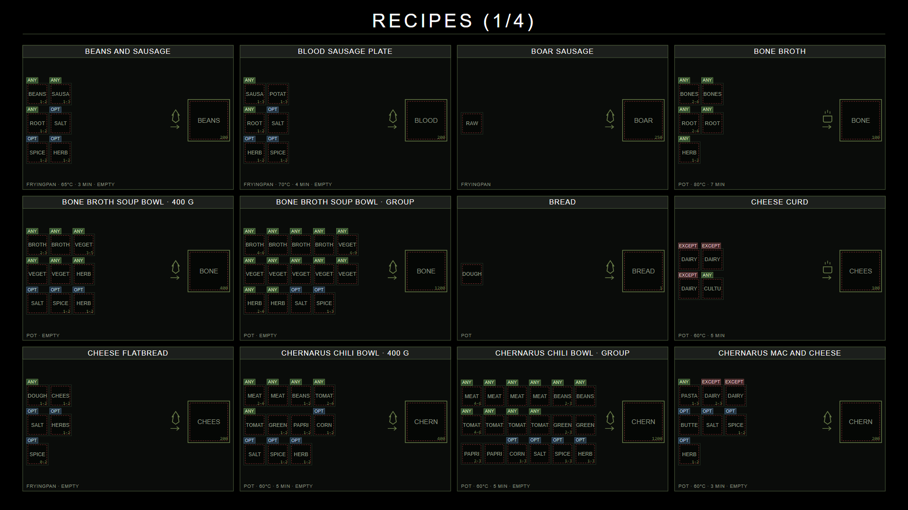
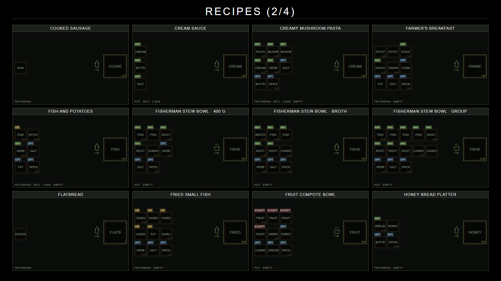
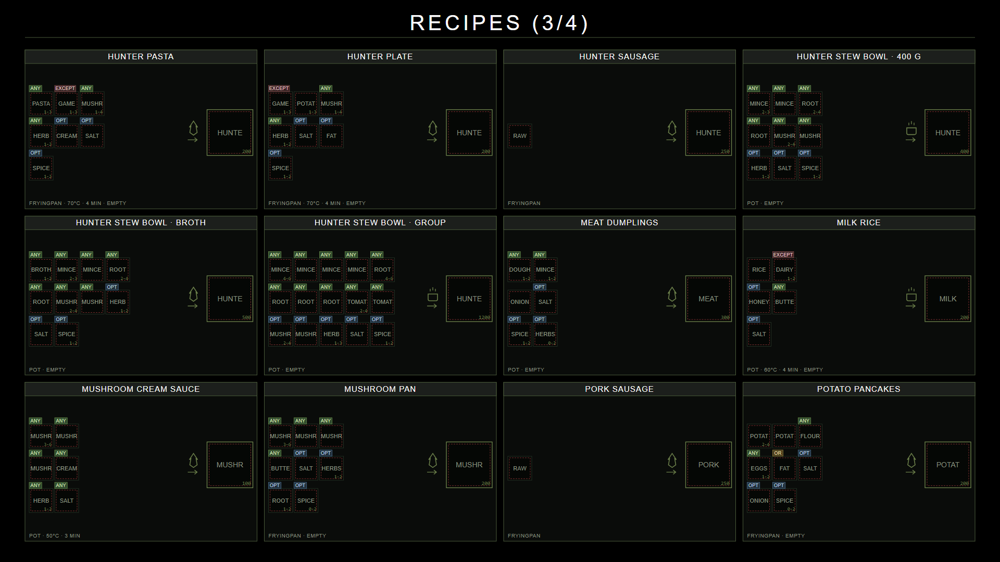
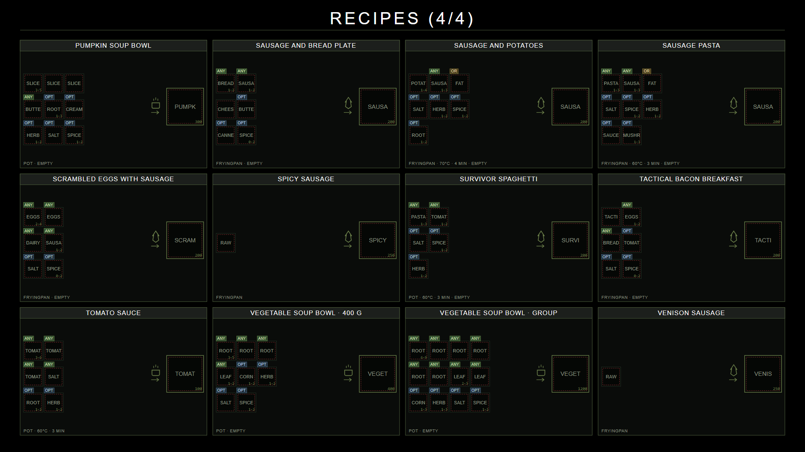

<!-- generated by tools/chefz-recipecards - do not edit by hand -->

# Recipe Cards

Every recipe of the mod as a card: what goes in on the left, what it takes
in the middle, what comes out on the right.

> Generated by `tools/chefz-recipecards` from the recipe records of the mod.
> **Do not edit this page by hand** -
> the next run overwrites it. Change the recipes, or the style config, and
> run `node tools/chefz-recipecards/index.mjs` again.

> **Item images are missing.** 96 of the classes on these cards have no image entry. The cards draw a dashed red
> placeholder with a short token instead, so a gap never looks like a picture.

## Page 1

## Page 2

## Page 3

## Page 4

## Next

- [Recipes](Recipes) - how a recipe is written and how the engine picks one
- [Recipe-Book](Recipe-Book) - the same recipes in prose
- [Recipe-Reference](Recipe-Reference) - every field of every record
- [Production-Chains](Production-Chains) - how the ingredients are made
